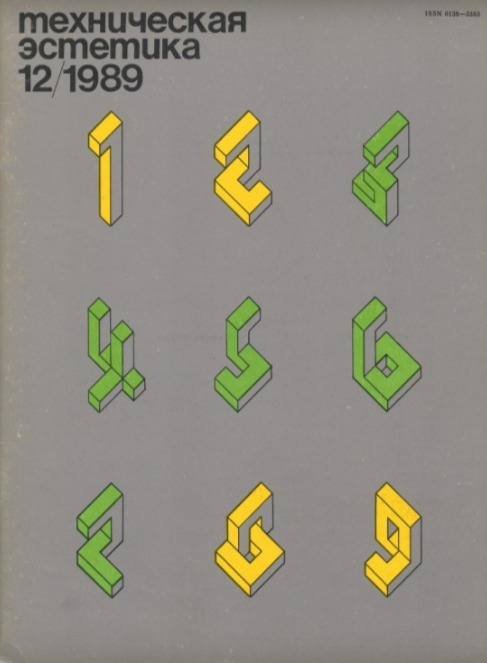
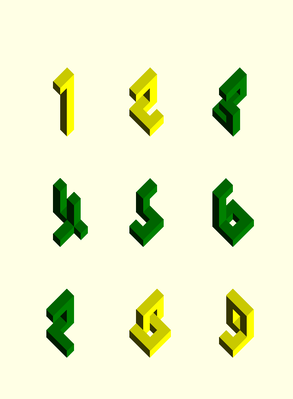
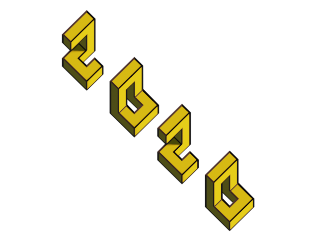

[](https://creativecommons.org/licenses/by/4.0)

# Tech Estetika Numbers

Numbers such as those on the cover of "Technicheskaya estetika" 1989/12 magazine created in 3D for orthographical projection. https://issuu.com/0083398/docs/tech_aest_1989_12

This script for [OpenSCAD](https://www.openscad.org) creates 3D objects in accordance with the specified parameters. They can be substituted according to the viewing angle. The objects are made up of cubes with two edges of the same length, and third vertical edge changes length depending of the angle of view. 

Supported symbols 1234567890+-.,:;

magazin cover| render
:-|-:
|

<!-- - [Usage](#usage) -->
- [Getting started](#getting-started)
- [Examples](#examples)
- [Documentation](#openscad-code)
    - [Global Variables](#global-variables)
    - [Print symbols](#print-symbols)
    - [Numbers symbols](#numbers-symbols)
    - [Special symbols]($special-symbols)
- [Command Line](#command-line)
- [Blender](#blender)
- [License](#License)

## Getting started

Made in [OpenSCAD](https://www.openscad.org) 2019.05. Support Window, Linux, MacOS.

Main library file is `tech_estetika_numbers.scad`. 

Add to project:
`include <tech_estetika_numbers.scad>`

Text in direction from top left to bottom right

```openscad
include <tech_estetika_numbers.scad>
$angle=10;
$vpr=[$angle,0,45];
numbers("+1.2","down");
```

Number one by one

```openscad
include <tech_estetika_numbers.scad>
$angle=10;
$vpr=[$angle,0,45];
$edge=1;
$vert_edge_base=sqrt(2)/2;
$vert_edge_k=$vert_edge_base/cos(90-$angle);
$direction="down";
translate([0,0,0]) plus();
translate([6,0,0]) number_1();
translate([12,0,0]) dot();
translate([18,0,0]) number_2();
```

## Examples

OpenSCAD:
- all_numbers.scad - all possible symbols in three directions.
- animation.scad - animation show how objects can be changed depending on view angle.
- book_cover.scad - same as numbers journal cover.
- print_numbers.scad - print custom numbers by variable.
- tech_estetika_numbers.scad - actually main library.

Animations:
- [animation/animation.gif](./animation/animation.gif) - shows how numbers recalculated in real time depending on view angle.
- [animation/animation_20deg.gif](./animation/animation_20deg.gif) - shows how numbers change shape from fixed view of $vpr=[20,0,45] 
- [animation/cover_animation.gid](./animation/cover_animation.gif) - animated compression cover and render.


## Documentation

### Global variables:

- `$angle` - Angle of view for which the shape of objects will be changed for better view. Best view is  rotation by X-axis is `$angle`. Y-axis fixed to 0, Z-axis fixed to 45 degree. Default is `5`
- `$edge` - Size of cube's edge. Default is `1`
- `$vert_edge_base` - Coefficient for `$edge` of vertical edge to fit length at the view angle. Default is `sqrt(2)/2`
- `$vert_edge_k` - Calculated coefficient to match `$vertical_edge_base` at view angle. Default is `$vert_edge_base/cos(90-$angle)`
- `$zero_rotate` - Bool rotate zero symbol. Default is `false `
- `$direction` - Text row direction "up", "down", "straight". Default is `"down"`
- `$x_axis_space` - Space between symbols along the X-axis. If not set then set by `$direction`. Default is `undef`
- `$y_axis_space` - Space between symbols along the Y-axis. If not set then set by `$direction`. Default is `undef`
- `$vpr` - OpenSCAD variable to set camera view rotation. Best is `[angle,0,45]`
- `$vpt` - OpenSCAD variable to set camera view translate. Best is `[0,0,0]`
- `$vpd` - OpenSCAD variable to set camera view distance to object. Best is `80`


### Print symbols:

`numbers(numbers_text, direction, x_axis_space, y_axis_space, edge, vert_edge_k)` - print text
- `numbers_text` - String with symbols +-1234567890.,;:
- `direction` - Direction of printing numbers "up" , "down", "straight". Default `$direction`
    - `"up"` - To top right corner. Space only over Y-axis
    - `"down"` - To bottom left corner. Space only over X-axis
    - `"straight"` - From left to right as usual. X-axis == Y-axis
- `x_axis_space` - Space between symbols over X-axis. Default is `$x_axis_space`
- `y_axis_space` - Space between symbols over Y-axis. Default is `$y_axis_space` 
- `edge`- Size of cube's edge. default is global variable `$edge`
- `vert_edge_k` - Coefficient to match vertical edge to fit length at view angle `$vert_edge_k`

### Numbers symbols
 
- `number_0($edge,$vert_edge_k,$zero_rotate);`
- `number_1($edge,$vert_edge_k);`
- `number_2($edge,$vert_edge_k);`
- `number_3($edge,$vert_edge_k);`
- `number_4($edge,$vert_edge_k);`
- `number_5($edge,$vert_edge_k);`
- `number_6($edge,$vert_edge_k);`
- `number_7($edge,$vert_edge_k);`
- `number_8($edge,$vert_edge_k);`
- `number_9($edge,$vert_edge_k);`

### Special symbols

- `dot($edge,$vert_edge_k,$direction);`
- `comma($edge,$vert_edge_k,$direction);`
- `semicolon($edge,$vert_edge_k,$direction);`
- `colon($edge,$vert_edge_k,$direction);`
- `plus($edge,$vert_edge_k,$direction);`
- `minus($edge,$vert_edge_k,$direction);`

## Command line 

Commands for bash and zsh

Create a 3D objects in stl format. To use special symbols like +-.,:; 
pay attention to the quotes

```bash
openscad -o ./result_5_deg.stl -D "\$angle=5" -D "text=\"12:34\"" ./print_numbers.scad
```

or with command line variables. a - angle of view, text - text with supported symbols.
pay attention to the quotes.
```bash
a=5; 
text="12:34";
openscad -o "./result_${a}_deg.stl" -D "\$angle=$a" -D "text=\"${text}\"" ./print_numbers.scad
```
Make png screenshot. Angle and camera X-axis should be the same for best result.
Attention `$vpr`,`$vpt`,`$vpd` does not work in command line mode, instead put data to command line according to the template `--camera=$vpt[0],$vpt[1],$vpt[2],$vpr[0],$vpr[1],$vpr[2],$vpd`
```bash
a=5; 
text="12:34";
openscad -o "result_${a}_deg.png" \
    -D "\$angle=${a}" \
    -D "text=\"${text}\"" \
    --projection=o \
    --imgsize=256,256 \
    --camera=10,2,0,"${a}",0,45,70 \
    ./print_numbers.scad
```


## Blender
Add numbers to [Blender 2.8](https://www.blender.org)

- Create new project. File -> New -> General
- Select Cube press Delete to delete Cube
- File -> Import -> .stl select stl created in OpenSCAD
- Select Camera in Scene Collection
- __Object Data Properties -> Lens -> Type -> Orthographic__
- Object Data Properties -> Lens -> "Orthographic Scale" make it fit to object
- Object Properties -> Transform -> Rotation X=$angle, Rotation Y=0, Rotation Z=45. $angle is variable used in OpenSCAD. Translate camera depending on object position. Use Ctrl+Numpad 0 to view result
- Any modification you like than press F12

Example render engine eevee


## License

Creative Common 4.0 (BY)

[](https://creativecommons.org/licenses/by/4.0)
